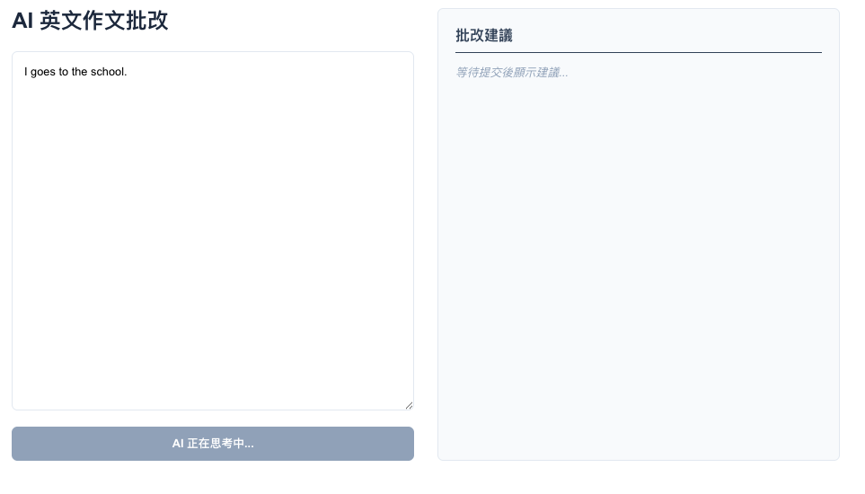
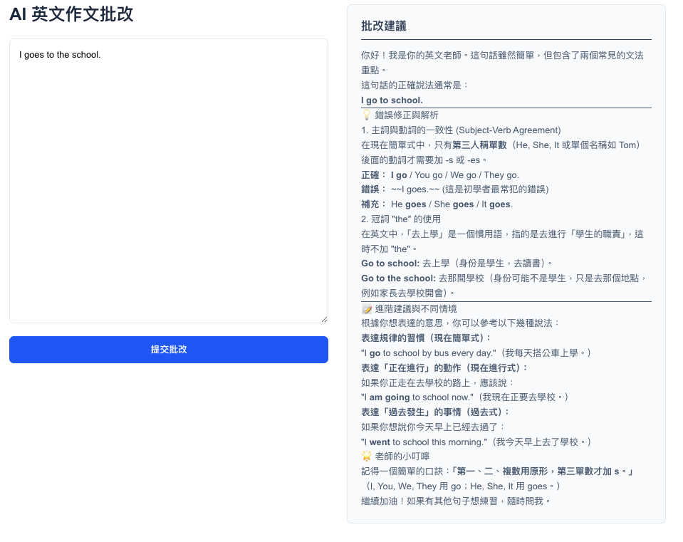

# AI Tutor

#### AI 思考畫面


#### AI 輸出畫面


一個基於 **六角架構 (Hexagonal Architecture)** 設計的英文作文批改系統。

## 系統架構
專案採用前後端分離設計，後端嚴格遵守 Ports and Adapters 模式：
* **Frontend**: Next.js 15 (App Router) + Tailwind CSS
* **Backend**: Flask + Google Gemini API

---
## 快速啟動

### 1. 後端 (Backend)
```bash
cd backend
pip install -r requirements.txt
# 在 .env 填入 GEMINI_API_KEY
python -m app.main
```

### 2. 前端 (Frontend)
```bash
cd frontend
npm install
npm run dev
```

## 目錄結構
- backend/app/core: 業務邏輯 (Domain Layer)
- backend/app/ports: 抽象介面 (AIServicePort)
- backend/app/adapters: 技術實作 (GeminiAdapter, WebAPI)
- frontend/src/app: Next.js 頁面與 UI 元件