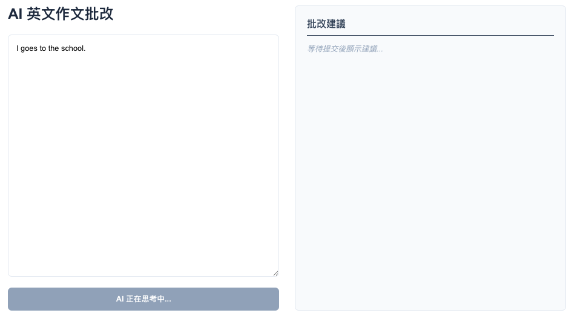
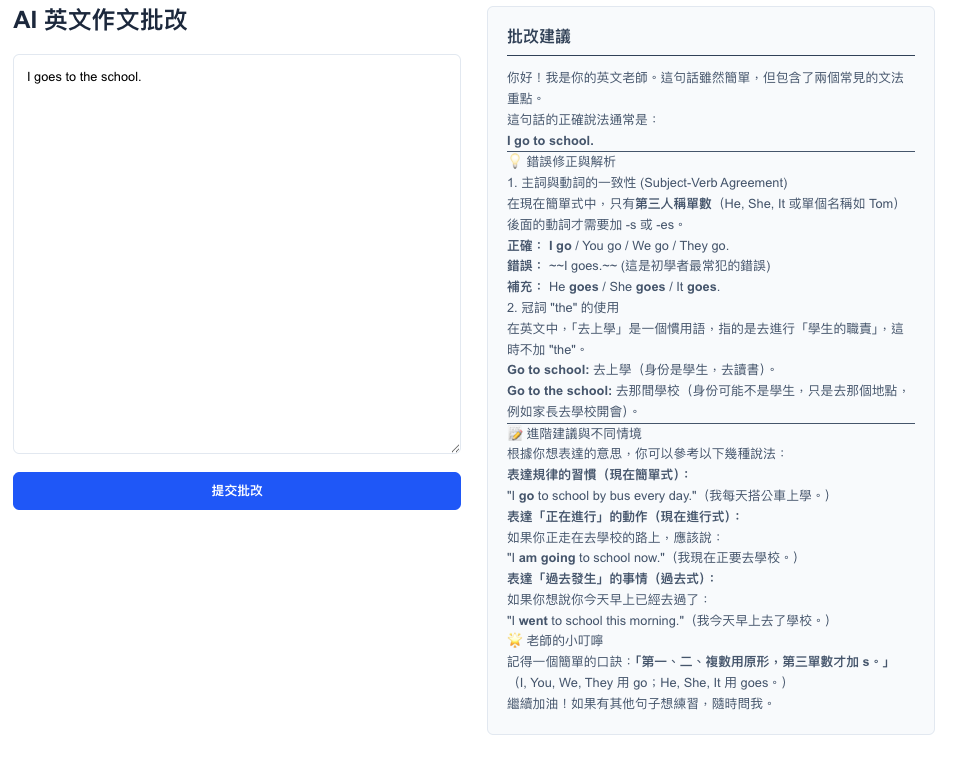

# AI Tutor

#### AI 思考畫面


#### AI 輸出畫面


一個基於 **六角架構 (Hexagonal Architecture)** 設計的英文作文批改系統。

## 系統架構
專案採用前後端分離設計，後端嚴格遵守 Ports and Adapters 模式：
* **Frontend**: Next.js 15 (App Router) + Tailwind CSS
* **Backend**: Flask + Google Gemini API
* **Prompt Management**: **Langfuse** (實現提示詞與代碼分離)

---
## 快速啟動

### 1. 後端 (Backend)
```bash
cd backend
pip install -r requirements.txt

# 在 .env 填入以下必要資訊：
# GEMINI_API_KEY=your_key
# LANGFUSE_PUBLIC_KEY=pk-lf-...
# LANGFUSE_SECRET_KEY=sk-lf-...
# LANGFUSE_HOST=https://cloud.langfuse.com

python -m app.main
```

### 2. 前端 (Frontend)
```bash
cd frontend
npm install
npm run dev
```

## Langfuse Prompt 管理
本專案透過 Langfuse 雲端託管 Prompt，優點在於：

* **即時更新**：在 Langfuse 後台修改 `essay-teacher-prompt` 內容即可改變 AI 行為，無需重新部署後端代碼。
* **版本控制**：自動追蹤 Prompt 歷史版本，支持 production/staging 標籤切換。

**設定步驟：**

1. 在 Langfuse 建立名為 `essay-teacher-prompt` 的範本。
2. 內容中使用 `{{user_content}}` 作為輸入變數。
3. 儲存並將 Label 設為 `production`。

---

## 目錄結構
- backend/app/core: 業務邏輯 (Domain Layer)
- backend/app/ports: 抽象介面 (AIServicePort)
- backend/app/adapters: 技術實作  (**GeminiAdapter**, WebAPI, **Langfuse SDK**)
- frontend/src/app: Next.js 頁面與 UI 元件